# Asana for Docusign Documentation

This is the documentation for the Asana integration with Docusign.

## How to Install and Configure

### Installing the App on Docusign

Please follow [the guide to install the Asana app](https://support.Docusign.com/s/document-item?language=en_US&bundleId=ous1698169987748&topicId=ctg1698170340729.html&_LANG=enus) from the Docusign App Center.

Once the app is installed, you’ll be prompted to connect the app to Asana. If you're not already logged in to Asana, you’ll be directed to the Asana login screen, where you can log in or sign up for an account.

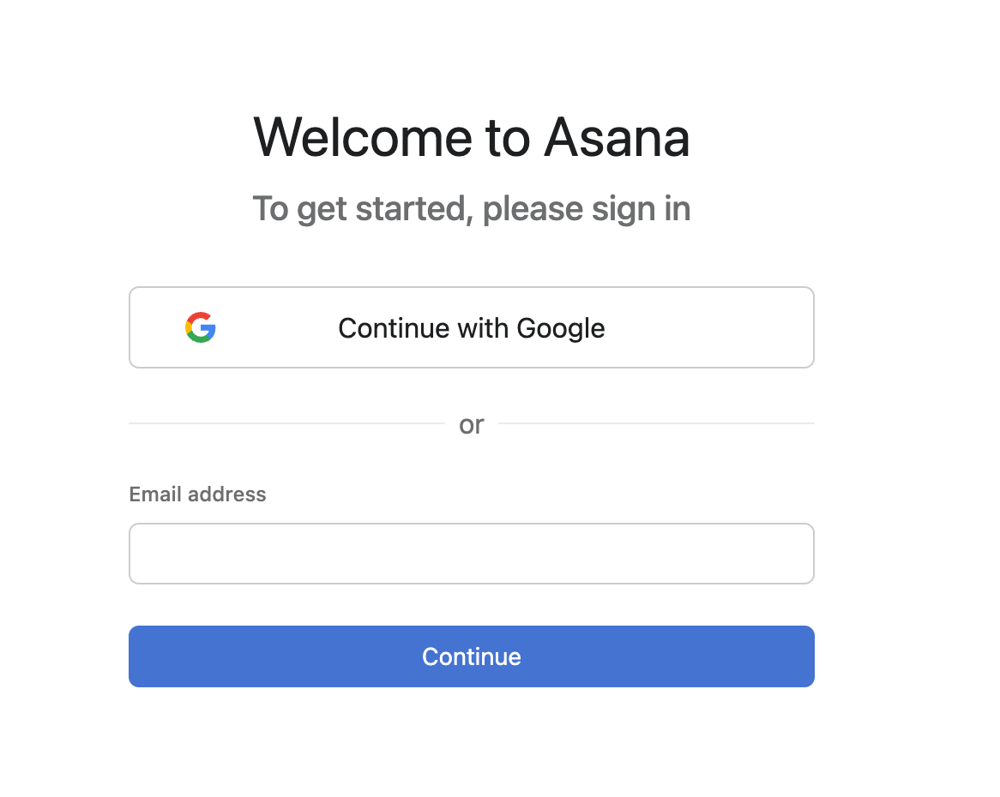

Please log in or sign up to proceed to the "Grant Permission" screen. Click **Allow** to allow the app to connect to your Asana account.

In the list of installed apps, the Asana app should now appear as active:

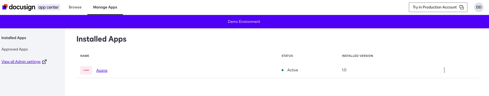

## How to Use the App

The Asana extension for Docusign simplifies creating and updating tasks in Asana as part of a Maestro workflow. After installing the app, several Asana options appear when adding a new step in the workflow builder.

You can start by creating a new workflow:

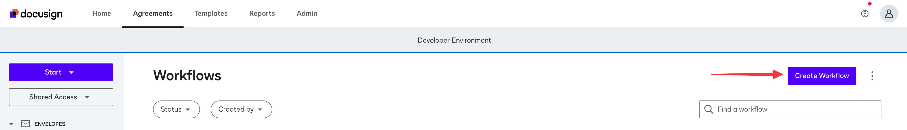

In the workflow, when adding a new step, you’ll see three possible Asana steps:

- **Export documents to Asana** to upload your Docusign envelopes to a Asana task.
- **Writeback to Asana** to update envelope status on a Asana task.
- **Read from Asana** to read task information, such as a task ID, for use in other steps.

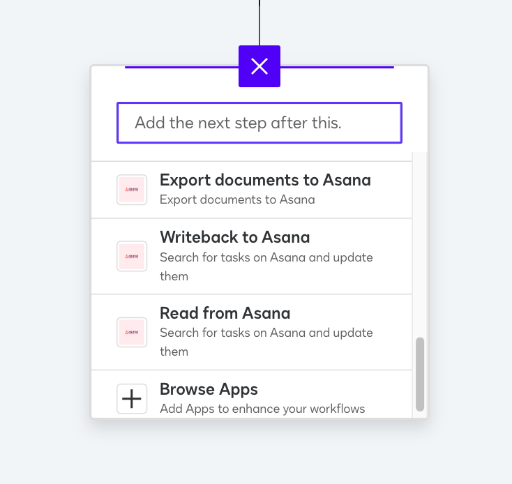

A common approach is to start with the **Read from Asana** task to find the task to update. This can be done by providing a task ID or using other criteria, such as the project name and value of the "Signer Email" field.

Click **Edit** on the step:

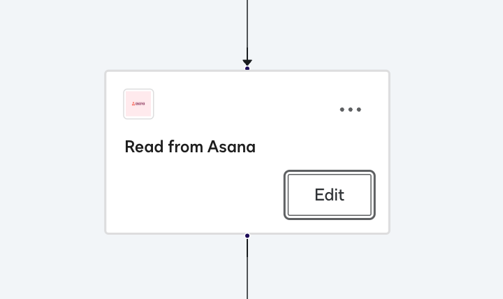

Now, configure the step to read a **Task**:

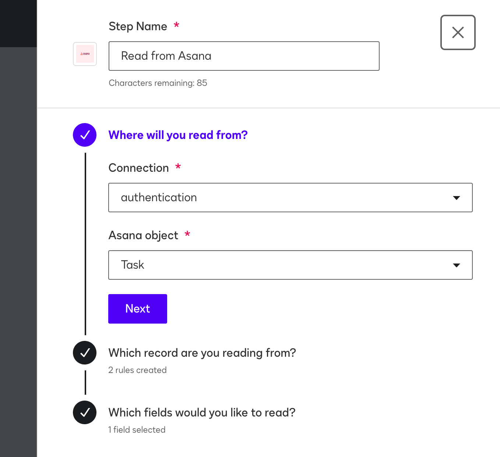

Click **Next** and configure the following rules:

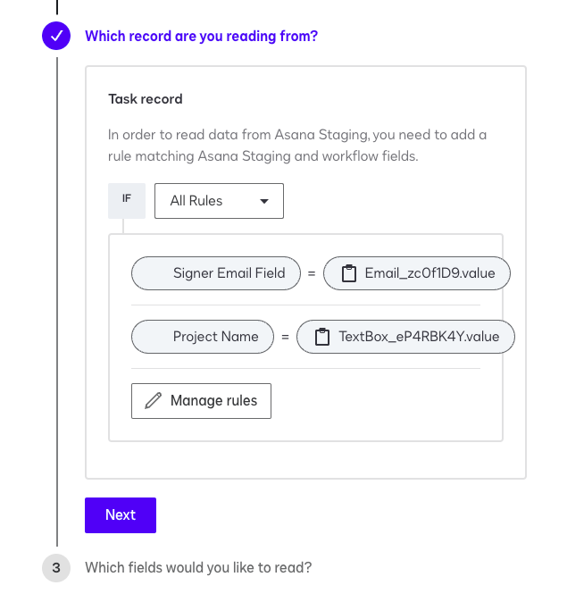

It’s important to select the **All Rules** option, as this narrows down the criteria to find a specific task under a project and with a specific assignee, identified by the value of the "Signer Email" field.

Workflow fields can be any variables in the workflow. For example, you can define a Web Form to read these values.

Click **Next** and choose **Task ID** and **Task Name** as the fields to read from the task found by the above criteria.

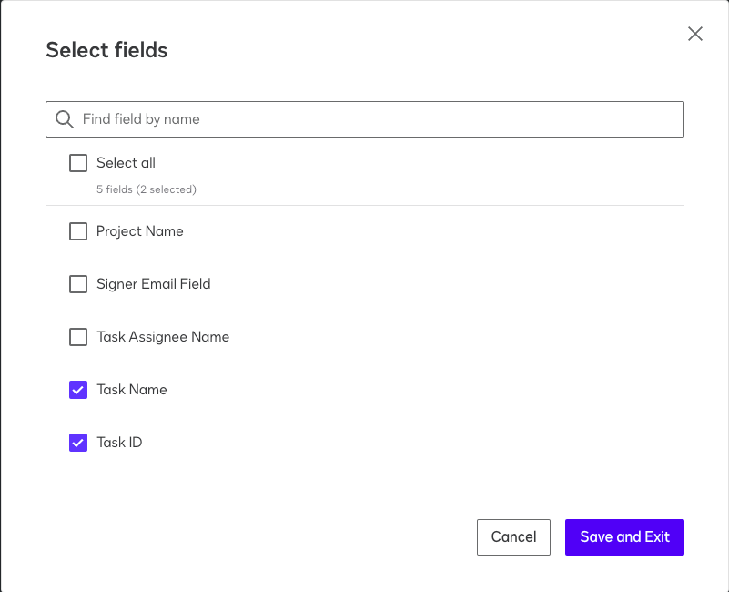

Next, add the **Get Signatures** step and map **Task Name* (the assigned person's name) to **Name** and **Assigned To** (the assigned person’s email) to **Signer Email Field**. This step will collect the signature and assign the person's name and email to the envelope.

Once the signer signs the envelope, the next step is to upload the envelope to the Asana task. Add the **Export documents to Asana** step to accomplish this. Here, the **Record ID** is the **Task ID**—this tells the step which task to upload the document to. The document will be uploaded to the task attachments.

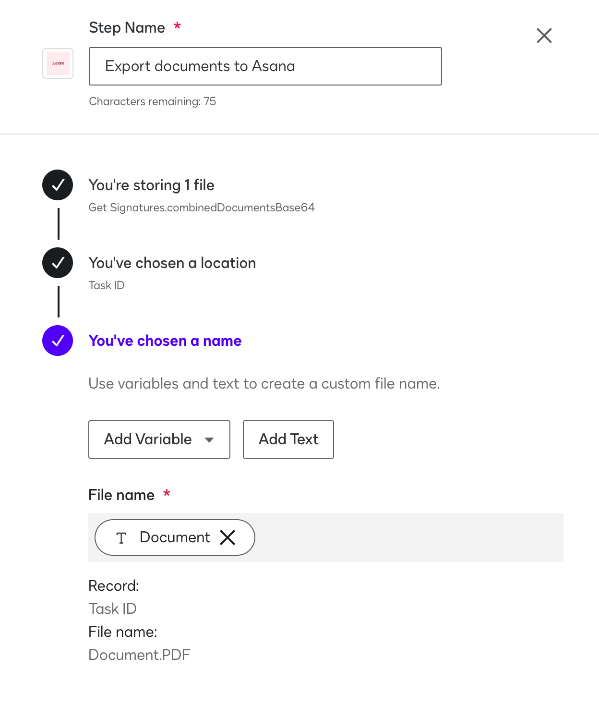

Next, use **Writeback to Asana** to update the status of the envelope on Asana. To make this work, provide the **Task ID** so the step can locate the correct task to update:

**Note**: When updating a task, if the task belongs to multiple projects and no project name is specified, the first project in the list will be used by default.

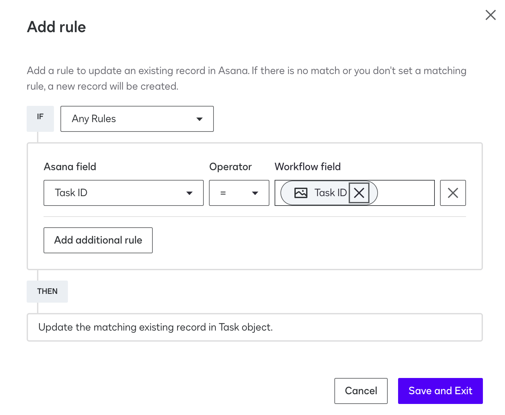

Under **Which fields are you writing to?**, map the **Envelope Status** variable returned from the **Get Signatures** step to the **Docusign Envelope Status** field on Asana. This field will be created if it doesn’t already exist.

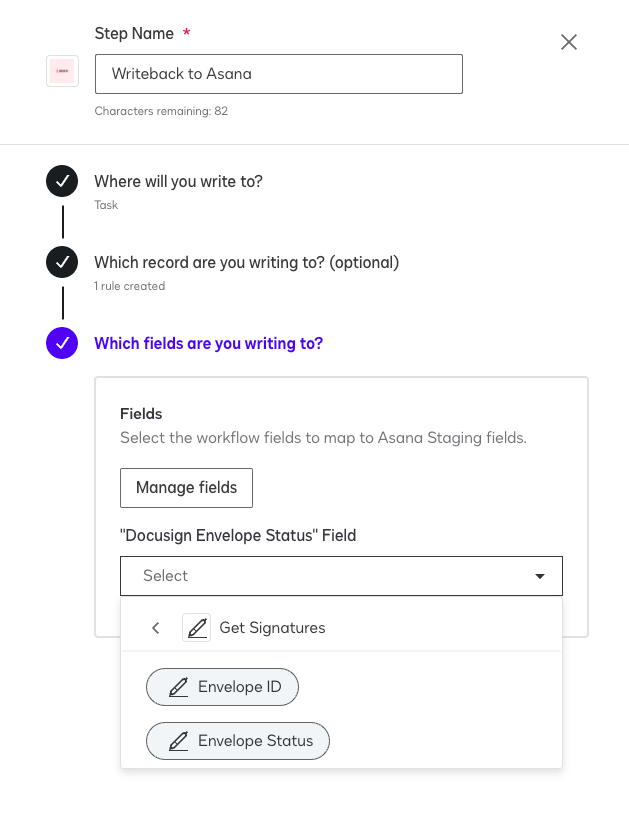

That's it! With this workflow, you can easily upload envelopes and update your tasks using the Asana app.

## FAQ

### Can I use custom field names for my Docusign status and envelopes?

Currently, this is not supported. The envelope status is written to the **Docusign Envelope Status** field, while the email is read by the **Signer Email** field.

### Why do I need to use the project name and signer email as inputs to the workflow?

The app works by finding and then updating a task. The project name and signer email can be used to locate the project of the task and then find the specific task assigned to the signer.

Alternatively, a task ID or the task assignee name and a task name can also be provided instead of a project name and signer email.

### Can the app create new tasks?

Yes, the **Writeback to Asana** step supports creating new tasks. This is described in the task description:

> Add a rule to update an existing record in Asana. If there is no match or you don't set a matching rule, a new record will be created.

If you provide a **Project Name** rule, this name will be used to find a suitable project on Asana. If no such project exists, an error will be raised. However, if you provide a **Task Name** rule, a task with that name will be created; otherwise, a **New task** will be generated. 

## Support

If you encounter any issues with the app or have feedback, please do not hesitate to contact us at [asana-support@thisdot.co](mailto:asana-support@thisdot.co).
